# DF0OHM in 2024

**Global Navigation**



**Page Navigation**

* TOC
{:toc}

## About DF0OHM

[DF0OHM](https://www.qrz.com/db/DF0OHM) is the amateur radio station of Technische Hochschule Nuernberg Georg Simon Ohm.

This page shows some impressions of DF0OHM in 2024.

This page only shows worked stations (except for satellite reception). All timestamps are specified in UTC.

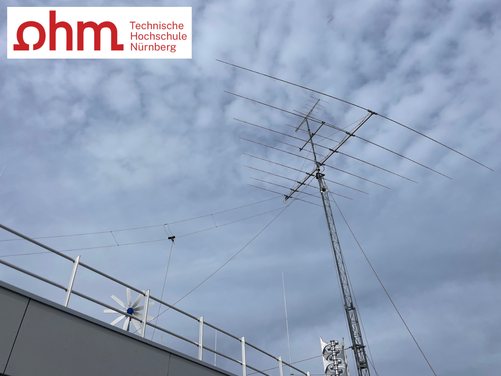

## Meta

```
Total QSO: 1441
First QSO: 2024-01-03 13:05:00
Last QSO: 2024-12-31 13:57:33
Num Paper QSL Sent: 911 (63.22%)
Num Locators: 961
My Locator: JN59NK
My Call: DF0OHM
```

## Interactive Map

<a href="df0ohm-2024/qso_map.html">Go</a> to full size<br />

Feel free to zoom in and out! Each QSO is represented by a marker. Click/Hover on a marker to see more information about the QSO.

<iframe src="df0ohm-2024/qso_map.html" width="100%" height="600" frameborder="0"></iframe>

## Plots

### Mode

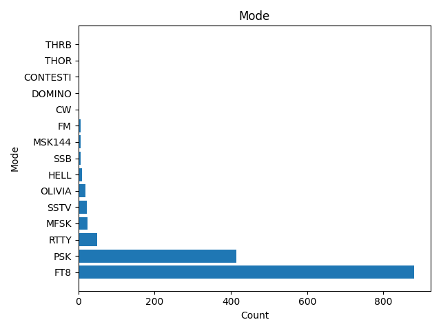

### Sub Mode

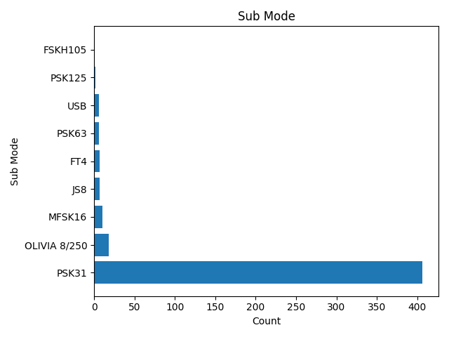

### Band

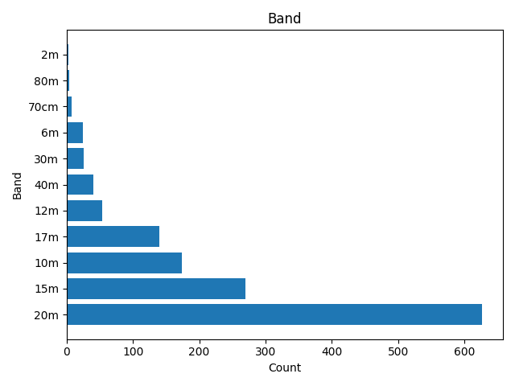

### Distance

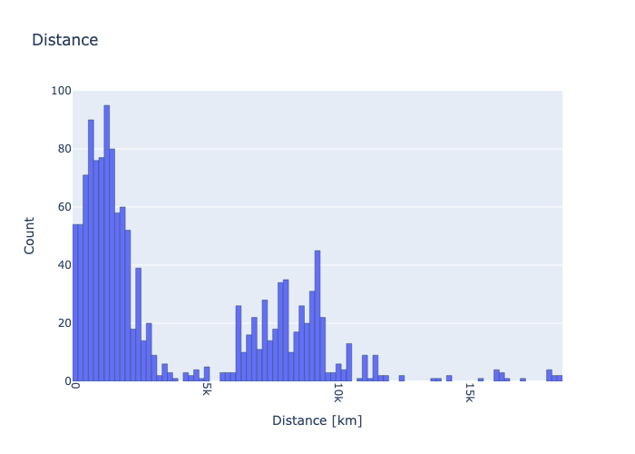

### Date

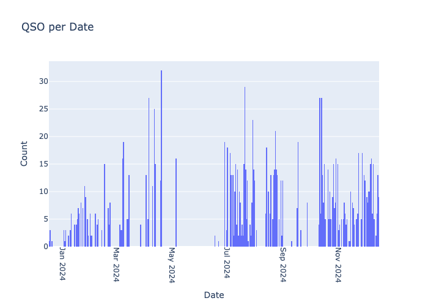

### Count over Time

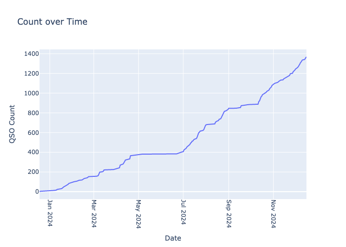

### Month of the Year

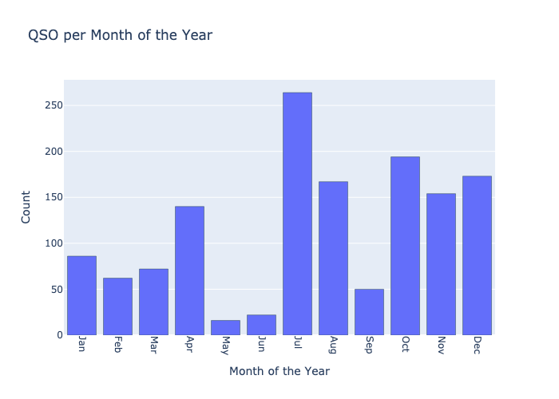

### Day of the Week

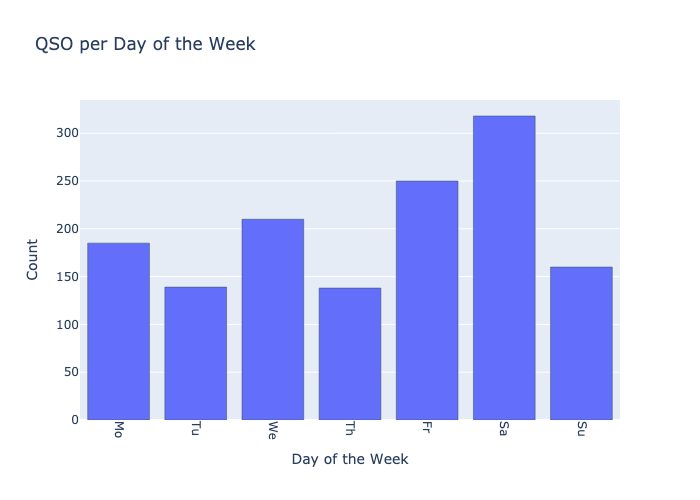

### Hour of the Day

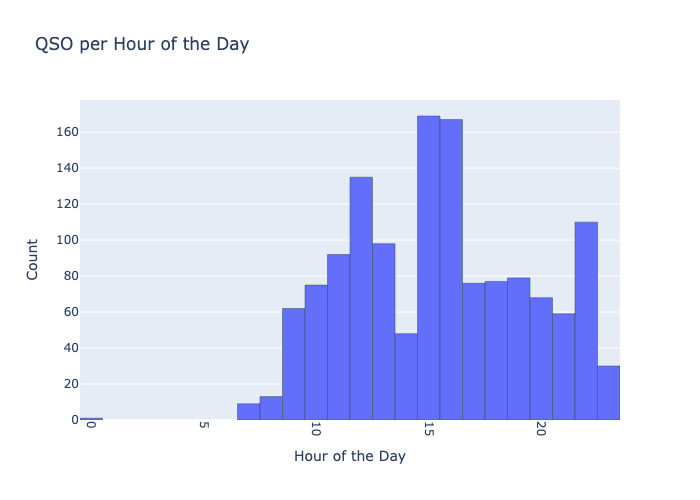

## FT8 Plots

### Distance vs. RST Rcvd


### Distance vs. RST Sent

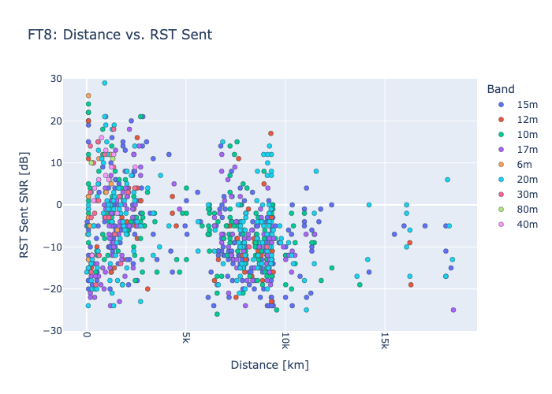

## Top Lists

### Durations

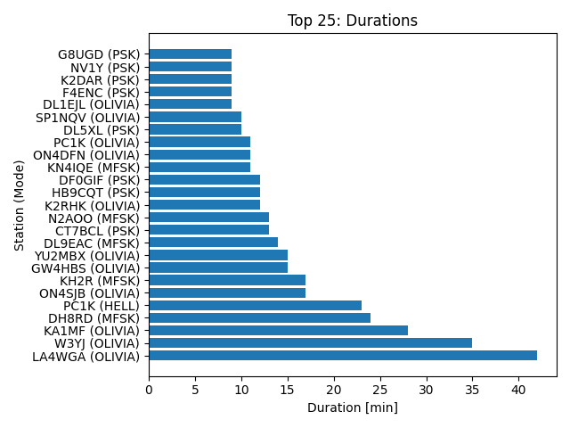

### Stations

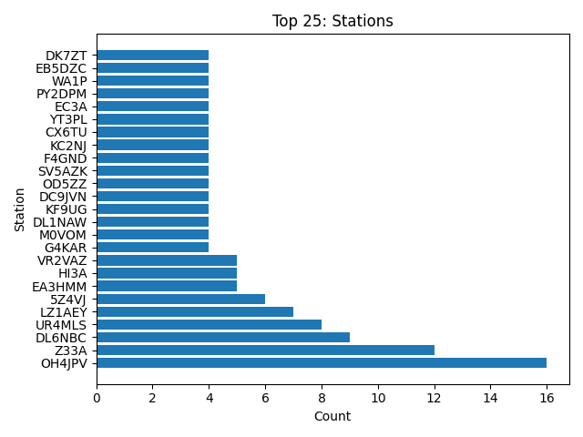

### Locators

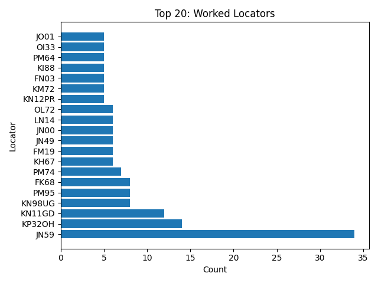

### Countries

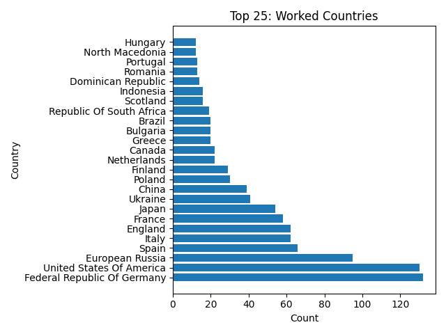

## Highlights

### Club / Special Stations Germany

```
# Club Stations Germany

2024-03-09 12:51:45 - DF0TV: Club Station Erlangen, B08
2024-07-17 20:56:23 - DL50WAF: Club Station from DL0AH
2024-10-30 09:57:30 - DL0DM: Deutsches Museum
2024-10-30 13:28:30 - DK0BMW: Clubstation BMW Werk Regensburg
2024-11-05 18:24:48 - DL0EPC: Karl
2024-11-28 13:10:44 - DK0PT: University Club Station OTH Regensburg
2024-12-01 12:13:04 - DF0GIF: Sigi DJ8VJ
2024-12-14 17:18:44 - DL0MLU: Martin-Luther-University

# Special Stations Germany

2024-12-27 12:42:00 - DQ0YOTA: YOTA Tom DF7TR
2024-12-29 19:24:44 - DP0POL: Research Vessel Polarstern
2024-12-30 12:11:15 - DP0GVN: Neumayer Station III 
```

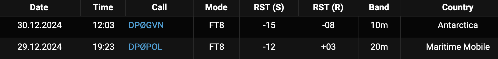

### ISS (22.07.24)

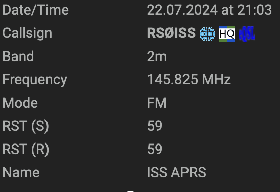
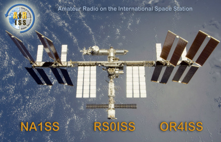

### Meteor Scatter (13.08.24)

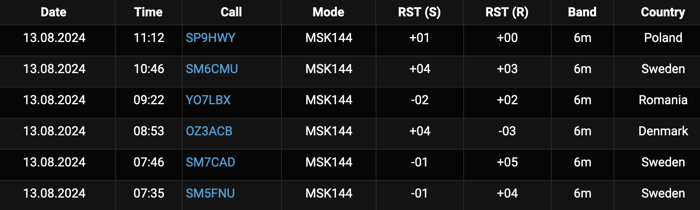

### SONATE-2 SSTV (15.12.24)

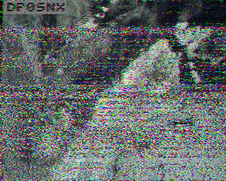
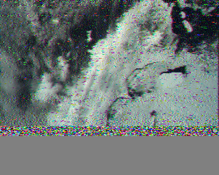

### ISS SSTV (12.24)

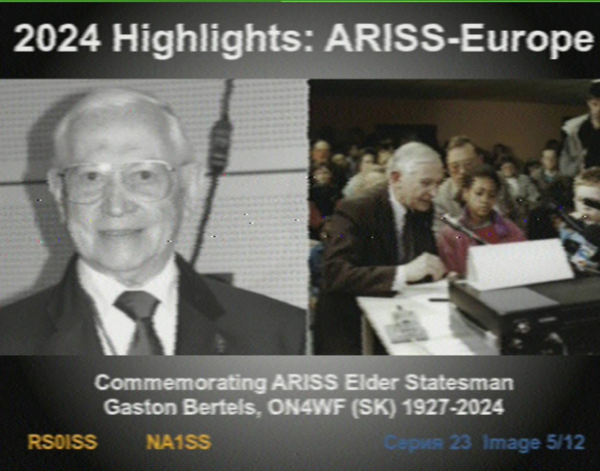
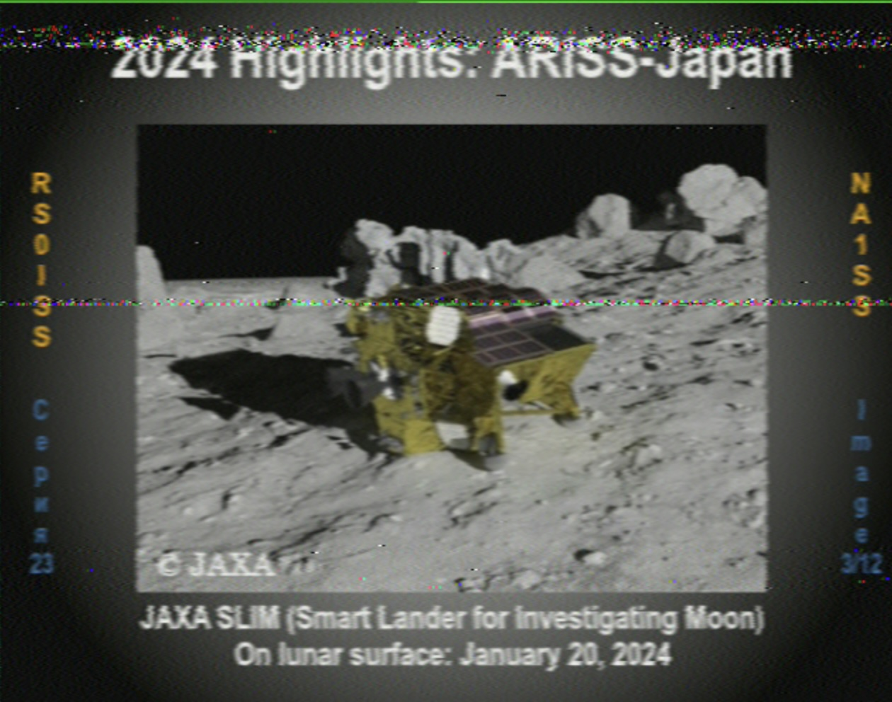

### Meteor M2-3 LRPT

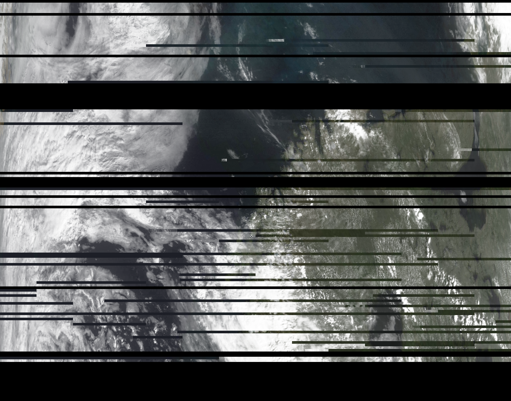

### A new mode for every QSO (UR4MLS)

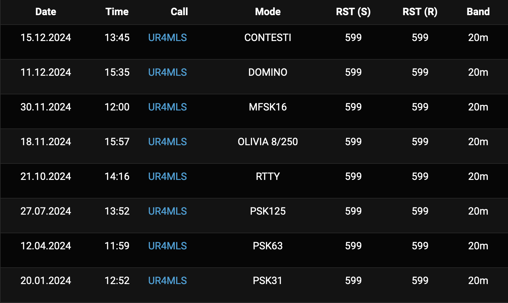

## Static Map

<a href="df0ohm-2024/qso_map.png">Go</a> to full size<br />
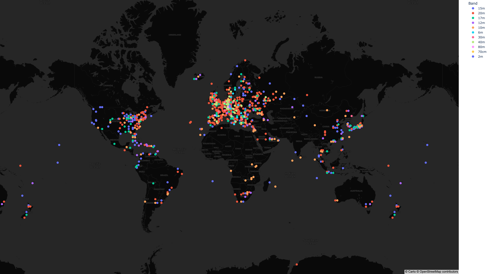


