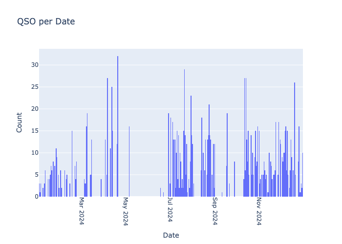

# DF0OHM in 2024

**Global Navigation**



**Page Navigation**

* TOC
{:toc}

## DF0OHM

## Statistics

## Map

## Map Interactive

<a href="df0ohm-2024/qso_map.html">Go</a> to full size 
<iframe src="df0ohm-2024/qso_map.html" width="100%" height="600" frameborder="0"></iframe>


