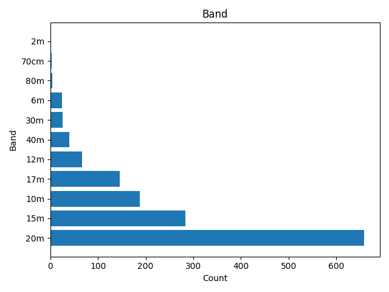
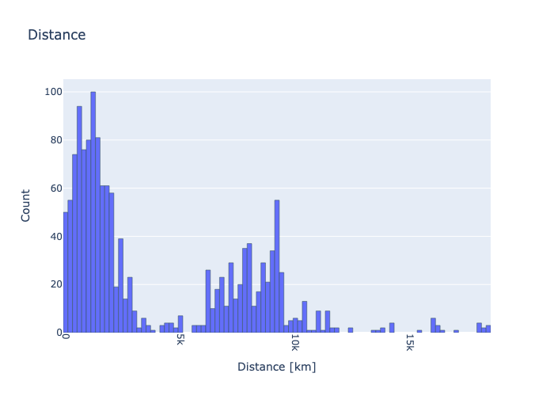
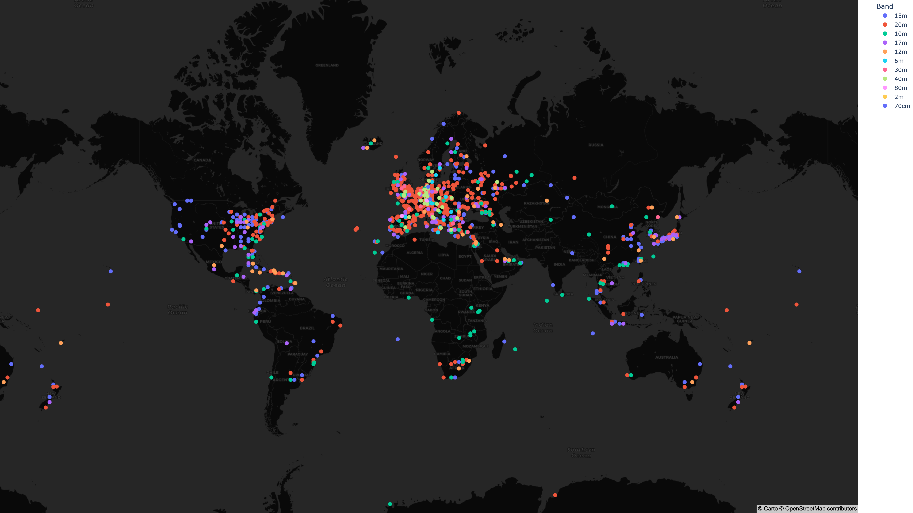

# DF0OHM in 2024

**Global Navigation**



**Page Navigation**

* TOC
{:toc}

## About DF0OHM

DF0OHM is the amateur radio station of Technische Hochschule Nuernberg Georg Simon Ohm. The station is located in Nuremberg (QTH JN59NK).

This page shows some impressions of DF0OHM in 2024.


## Meta

```
Total QSOs: 1368
First QSO: 2023-12-18 17:30:00
Last QSO: 2024-12-16 19:15:29
Num QSL Sent: 913 (66.74%)
Num Locators: 920
My Locator: JN59NK
My Call: DF0OHM
```

## Interactive Map

<a href="df0ohm-2024/qso_map.html">Go</a> to full size<br />
<iframe src="df0ohm-2024/qso_map.html" width="100%" height="600" frameborder="0"></iframe>

## Plots







## Top Lists


## Clubstations Germany

```
DL0EPC Karl
DK0PT University Club Station OTH Regensburg
DF0TV Club Station Erlangen, B08
DL0DM Deutsches Museum
DL0MLU Martin-Luther-University
DK0BMW Clubstation BMW Werk Regensburg
DF0GIF Sigi DJ8VJ
```

## Static Map

<a href="df0ohm-2024/qso_map.png">Go</a> to full size<br />



