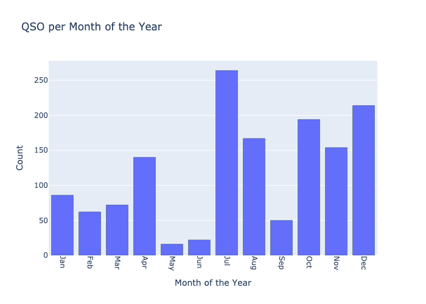
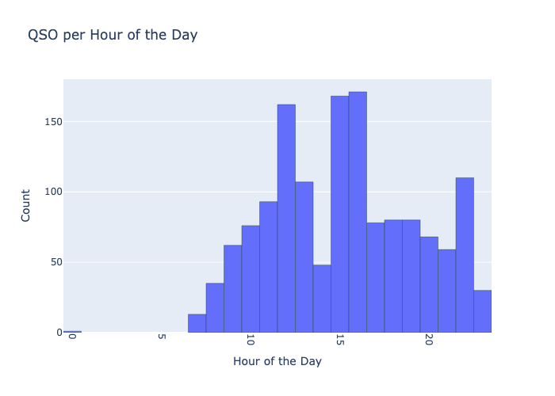
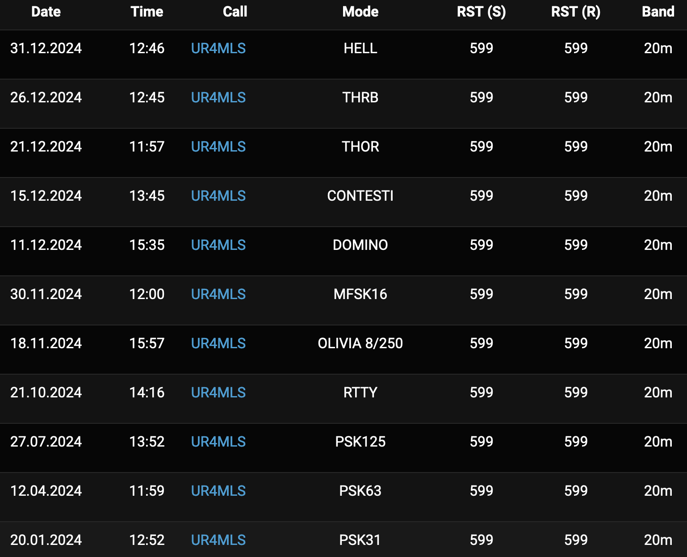

# DF0OHM in 2024

**Global Navigation**



**Page Navigation**

* TOC
{:toc}

## About DF0OHM

[DF0OHM](https://www.qrz.com/db/DF0OHM) is the amateur radio station of Technische Hochschule Nuernberg Georg Simon Ohm.

This page shows some impressions of DF0OHM in 2024.

This page only shows worked stations (except for satellite reception). All timestamps are specified in UTC.


## Meta

```
Total QSO: 1368
First QSO: 2023-12-18 17:30:00
Last QSO: 2024-12-16 19:15:29
Num QSL Sent: 913 (66.74%)
Num Locators: 920
My Locator: JN59NK
My Call: DF0OHM
```

## Interactive Map

<a href="df0ohm-2024/qso_map.html">Go</a> to full size<br />
<iframe src="df0ohm-2024/qso_map.html" width="100%" height="600" frameborder="0"></iframe>

## Plots

### Mode


### Sub Mode


### Band


### Distance


### QSO per Date


### QSO Count over Time


### QSO per Month of the Year



### QSO per Day of the Week


### QSO per Hour of the Day



## Top Lists

### Longest QSO


### Stations


### Locators


### Countries


## Highlights

### ISS (22.07.24)


### Meteor Scatter (13.08.24)


### SONATE-2 SSTV (15.12.24)


### Meteor M2-3 LRPT


### A new mode for every QSO



### Clubstations Germany

```
2024-03-09 12:51:45 - DF0TV: Club Station Erlangen, B08
2024-10-30 09:57:30 - DL0DM: Deutsches Museum
2024-10-30 13:28:30 - DK0BMW: Clubstation BMW Werk Regensburg
2024-11-05 18:24:48 - DL0EPC: Karl
2024-11-28 13:10:44 - DK0PT: University Club Station OTH Regensburg
2024-12-01 12:13:04 - DF0GIF: Sigi DJ8VJ
2024-12-14 17:18:44 - DL0MLU: Martin-Luther-University
```

## Static Map

<a href="df0ohm-2024/qso_map.png">Go</a> to full size<br />



