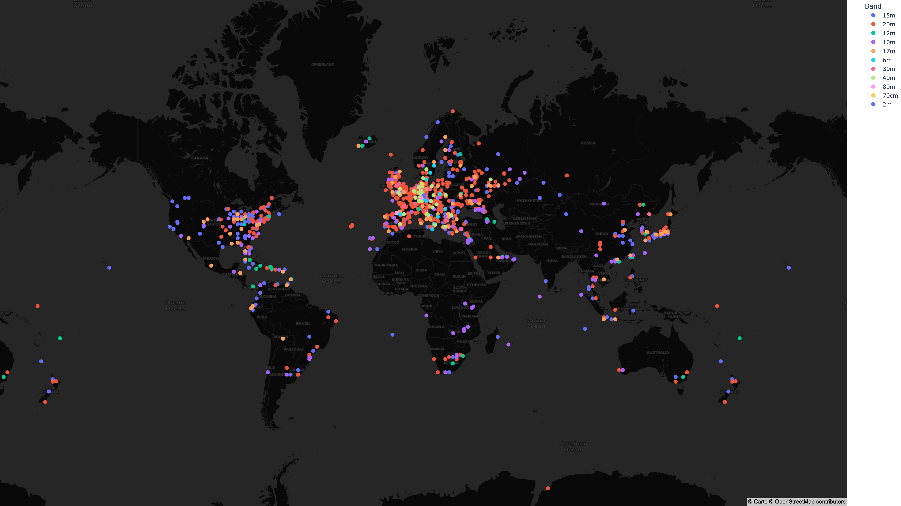
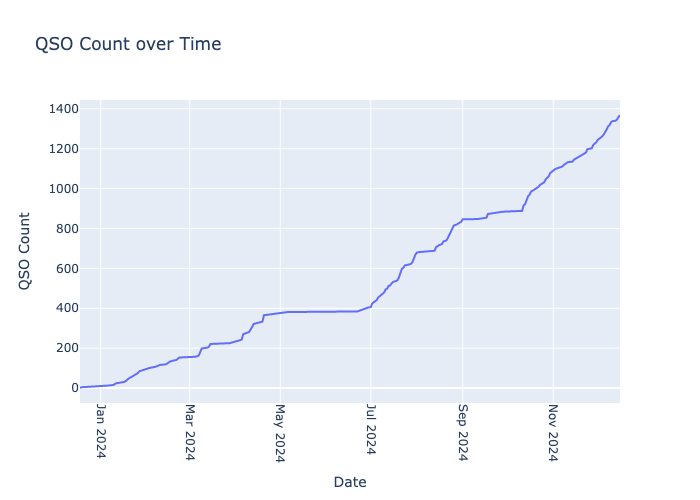
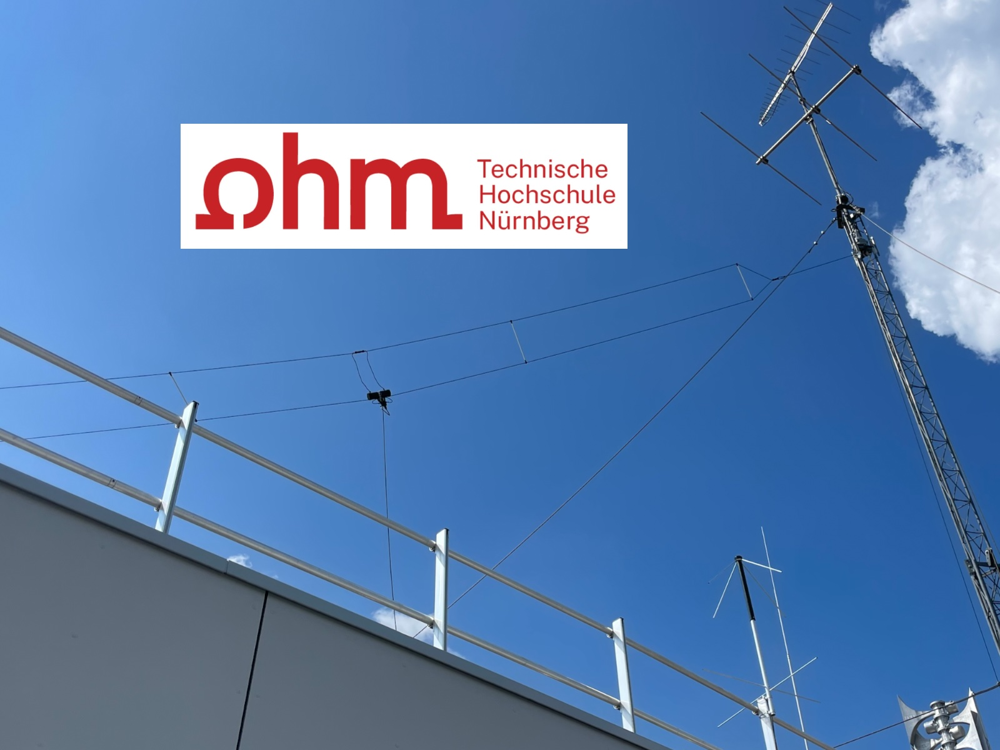

# DD7MB

Website of DD7MB

`amateur radio - ham radio - DD7MB`

Author: [Maximilian Bundscherer](https://bundscherer-online.de)

**Global Navigation**



**Page Navigation**

* TOC
{:toc}

## About Me

Hello everyone,

I am happy to be a radio amateur now (12/12/2023)! I am located in Nuremberg (QTH JN59NK) and I am a member of DARC (DOK B11). I prefer **QSL via Bureau** - alternatively also via eQSL and QRZ.

I am mainly active using the following callsigns and radios:

* [DF0OHM](https://www.qrz.com/db/DF0OHM) - *HF/VHF/UHF* - Club Station Of Technische Hochschule Nuernberg Georg Simon Ohm (Kenwood TS-2000X or Icom IC-7300 with 5LPDA8 and T2FD Antenna)
* [DD7MB](https://www.qrz.com/db/DD7MB) - *HF* - Personal callsign (Icom IC-7300 with Difona HF-P1 Antenna)
* [DD7MB/P](https://www.qrz.com/db/DD7MB) - *VHF/UHF* - Portable operation (Alinco DJ-MD-5X-EG)

I am interested in many modes, especially PSK31, Olivia, CW/Morse, satellite communication, Meteor Scatter, RTTY, FT8, JS8, SSTV and further developments of these modes.

You can also visit my [A-SDR / Independer](https://a-sdr.org) website.

73

DD7MB

## DF0OHM in 2024

I am currently mainly active on HF with [DF0OHM](https://www.qrz.com/db/DF0OHM).

I have published a small report for this station for the year 2024. You can find it [here](df0ohm-2024.md).

## Satellite Ground Station (SatNOGS)

I operate a [satellite ground station](https://network.satnogs.org/stations/3689/) at DF0OHM in the SatNOGS network.

An RTL-SDR (Nooelec v5) with a Turnstile antenna (TA-1) for VHF is currently in use. In the future, an azimuth and elevation rotor with Cross-Yagis will be used.

## A-SDR and Antennas

Before my amateur radio days, I focussed on receiving radio signals via SDR. That's why I still like to use my Nooelec SDR sticks for reception today.

I use a MoonRaker groundplane antenna and an Active MLA-30 loop antenna with a HF upconverter (Ham It Up). Sometimes I also use a receiver amplifier, also from MoonRaker. Furthermore I use a HackRF with the ANT500 antenna.

Read more about this on my [A-SDR / Independer](https://a-sdr.org) website.

## APRS

I regularly send APRS messages via my LoRa iGate [DD7MB (aprs.fi)](https://aprs.fi/info/DD7MB). I also use it to forward messages to the APRS-IS.

I use [DD7MB-9 (aprs.fi)](https://aprs.fi/info/DD7MB-9) when I'm travelling on foot or by car.

## Logbook(s)

### DF0OHM

I am currently mainly active on HF with [DF0OHM](https://www.qrz.com/db/DF0OHM).

<iframe frameborder="0" height="400" scrolling="yes" src="https://logbook.qrz.com/lbstat/DF0OHM/" width="90%"></iframe>

### DD7MB

My [QRZ-logbook](https://www.qrz.com/db/DD7MB) does not contain any other callsigns or suffixes used by me (e.g. DF0OHM or /P).

<iframe frameborder="0" height="400" scrolling="yes" src="https://logbook.qrz.com/lbstat/DD7MB/" width="90%"></iframe>

## HF Propagation

For propagation conditions, especially for QTH Germany, I recommend the [weather and propagation forecast by fading.de](https://www.fading.de/funkwetter/das-aktuelle-funkwetter) and the [DX propagation map by DR2W](https://dr2w.de/dx-propagation/).

I also recommend the [solar-terrestrial data by hamqsl.com](https://www.hamqsl.com/solar.html):

[VOACAP](https://www.voacap.com/11m/index.html) and [KC2G](https://prop.kc2g.com/) can also be useful to estimate propagation conditions.

## Contact

* Mail: <a href="mailto:maximilian@bundscherer-online.de">maximilian@bundscherer-online.de</a>
* CallSign: DD7MB
* Radio-ID (DMR): 2631609

I am mainly active on HF at the moment. When I'm active on VHF and UHF, I usually listen on the local FM analogue and DMR repeaters (Brandmeister Network - Talkgroups 26284, 26391).

If you want the message to arrive (reliably), please send it by e-mail.

## Reception Report

Did you hear me? I would be delighted if you would let me know when you heard me. I have set up a [small and simple online form](https://forms.gle/byaGX86faruhT4m97) for this purpose. Alternatively, you can also use the following form directly:

<iframe src="https://docs.google.com/forms/d/e/1FAIpQLSeNXHDvpPxTlIa8USekKusagtEgMAPDu1zNjDGgaevJW4xSGg/viewform?embedded=true" width="90%" height="400" frameborder="0" marginheight="0" marginwidth="0">Loading...</iframe>


