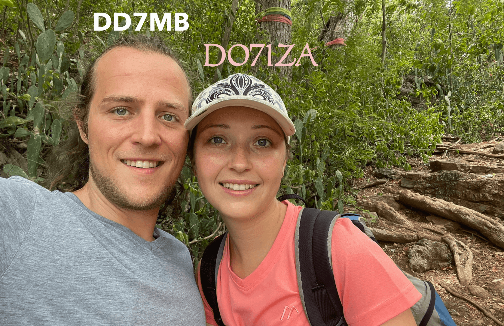
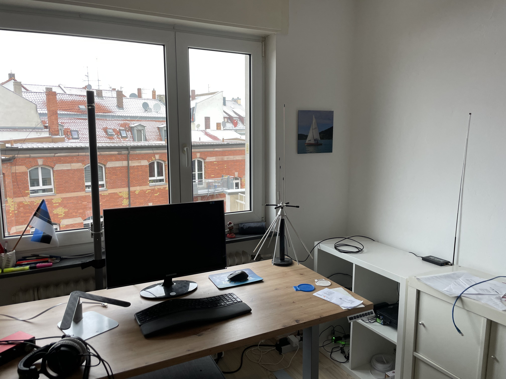

# DD7MB

Website of DD7MB

`amateur radio - ham radio - DD7MB`

Author: [Maximilian Bundscherer](https://bundscherer-online.de)

**Global Navigation**



**Page Navigation**

* TOC
{:toc}

## About Me

Hello everyone,

I am happy to be a radio amateur now (12/12/2023)! I am located in Nuremberg (QTH JN59NK) and I am a member of DARC (DOK B11).

Thankfully I am allowed to use the club station [DF0OHM](https://www.qrz.com/db/DF0OHM) - thanks to [DL1NAW](https://www.qrz.com/db/DL1NAW). There I am mainly active on HF at the moment. I use an ALINCO DJ-MD-5X-EG handheld radio for DMR & FM and APRS.

I am interested in many modes, especially PSK31, FT8, Olivia, JS8, satellite communication, RTTY, SSTV, APT, and further developments of these modes.

Did you hear me? I would be delighted if you would let me know when you heard me. I have set up a [small and simple online form](https://forms.gle/byaGX86faruhT4m97) for this purpose. This form is also included at the bottom of this website.

You can also visit my [A-SDR / Independer](https://a-sdr.org) website.

73

DD7MB

## Contact

- Mail: <a href="mailto:maximilian@bundscherer-online.de">maximilian@bundscherer-online.de</a>
- CallSign: DD7MB
- Radio-ID (DMR): 2631609

I am mainly active on HF at the moment. When I'm active, I usually listen on the local FM analogue and DMR repeaters (Brandmeister Network - Talkgroups 26284, 26391).

If you want the message to arrive (reliably), please send it by e-mail.

## A-SDR and Antennas

Before my amateur radio days, I focussed on receiving radio signals via SDR. That's why I still like to use my Nooelec SDR sticks for reception today.

I use a MoonRaker groundplane antenna and an Active MLA-30 loop antenna with a HF upconverter (Ham It Up). Sometimes I also use a receiver amplifier, also from MoonRaker. Furthermore I use a HackRF with the ANT500 antenna.

Read more about this on my [A-SDR / Independer](https://a-sdr.org) website.

## APRS

I only send APRS messages [DD7MB (aprs.fi)](https://aprs.fi/info/DD7MB) from time to time. I use [DD7MB-9 (aprs.fi)](https://aprs.fi/info/DD7MB-9) when I'm travelling on foot or by car.

## Logbook(s)

### DF0OHM

I am allowed to manage the QRZ page of the club station [DF0OHM](https://www.qrz.com/db/DF0OHM) - it has its own [logbook](https://logbook.qrz.com/lbstat/DF0OHM/). There I am mainly active on HF at the moment.

<iframe frameborder="0" height="400" scrolling="yes" src="https://logbook.qrz.com/lbstat/DF0OHM/" width="90%"></iframe>

### DD7MB

I only synchronise my logbook with my [QRZ-Logbook](https://logbook.qrz.com/lbstat/DD7MB/) from time to time. This logbook is not complete and does not contain any other callsigns or suffixes used by me (e.g. DF0OHM or /P).

<iframe frameborder="0" height="400" scrolling="yes" src="https://logbook.qrz.com/lbstat/DD7MB/" width="90%"></iframe>

## HF Propagation

## Reception Report

Did you hear me? I would be delighted if you would let me know when you heard me. I have set up a [small and simple online form](https://forms.gle/byaGX86faruhT4m97) for this purpose. Alternatively, you can also use the following form directly:

<iframe src="https://docs.google.com/forms/d/e/1FAIpQLSeNXHDvpPxTlIa8USekKusagtEgMAPDu1zNjDGgaevJW4xSGg/viewform?embedded=true" width="90%" height="400" frameborder="0" marginheight="0" marginwidth="0">Loading...</iframe>


